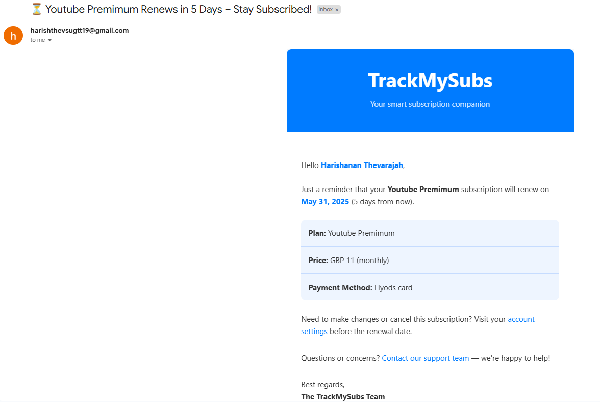

# 📧 TrackMySubs – Subscription Tracker API
TrackMySubs is a robust backend service designed to help users manage and track their subscriptions. It provides features like automatic email reminders before subscription renewals, secure user authentication, and seamless integration with MongoDB for data persistence. Built with Node.js, Express, Mongoose, and Upstash Workflows, this API is scalable and developer-friendly.


  ## Email Reminder Example
Below is an example of the email reminder sent to users for their subscription renewals:



## Features
- **User Authentication**: Secure user registration and login with JWT-based authentication.
- **Subscription Management**: Create, read, update, and delete (CRUD) subscription records.
- **Automatic Email Reminders**: Sends reminders to users before subscription renewals using Upstash Workflows.
- **MongoDB Integration**: Stores user and subscription data efficiently with Mongoose.
- **RESTful API**: Well-structured endpoints for easy integration with frontend applications.
- **Environment Configuration**: Uses environment variables for secure configuration.

## Technologies Used
- **Node.js**: JavaScript runtime for building the backend. [nodejs.org](https://nodejs.org)
- **Express**: Web framework for creating RESTful APIs. [expressjs.com](https://expressjs.com)
- **MongoDB**: NoSQL database for storing user and subscription data. [mongodb.com](https://www.mongodb.com)
- **Mongoose**: ODM for MongoDB to manage data schemas. [mongoosejs.com](https://mongoosejs.com)
- **Upstash Workflows**: Serverless workflow for scheduling and managing email reminders. [upstash.com](https://upstash.com)
- **Arcjet**: Security platform for rate limiting using the token bucket algorithm. [arcjet.com](https://arcjet.com)
- **JWT**: JSON Web Tokens for secure authentication. [jwt.io](https://jwt.io)
- **Nodemailer**: For sending email reminders. [nodemailer.com](https://nodemailer.com)
- **dayjs**: For date manipulation in workflows. [day.js.org](https://day.js.org)
- **dotenv**: For managing environment variables. [npmjs.com/package/dotenv](https://www.npmjs.com/package/dotenv)


## Technical Details
- **Rate Limiting with Arcjet**: The API uses Arcjet to implement rate limiting, ensuring protection against abuse and denial-of-service attacks. Arcjet employs the **token bucket algorithm**, which allocates a fixed number of tokens to each user or IP address within a time window. Each API request consumes a token, and requests are blocked if the bucket is empty until it refills at a defined rate. This ensures fair usage and maintains API performance under high load.
- **MongoDB Schema Design**: Mongoose schemas are used to enforce data consistency for users (with fields like name, email, and hashed password) and subscriptions (with fields like name, amount, and renewal date).
- **Upstash Workflows for Email Reminders**: Upstash Workflows is used to schedule and manage email reminders for subscription renewals. Each subscription is associated with a workflow that triggers email reminders at 7, 5, 2, and 1 day(s) before the renewal date. The workflow, implemented using the `@upstash/workflow/express` package, leverages the `context.sleepUntil` method to pause execution until the precise date of each reminder. The workflow:
  - Fetches subscription details from MongoDB using Mongoose, including user data (name and email).
  - Checks if the subscription is active and if the renewal date has not passed.
  - Iterates through the reminder intervals (7, 5, 2, 1 day(s)), scheduling each using `context.sleepUntil`.
  - Triggers a Nodemailer task via `sendReminderEmail` to send a notification to the user’s email when the reminder date is reached.
  - Uses `dayjs` for precise date calculations and comparisons.
  This serverless approach ensures scalability, eliminates the need for cron jobs, and supports retries for failed email deliveries to ensure reliable notifications.

## Getting Started

### Prerequisites
- Node.js (v16 or higher)
- MongoDB Atlas account or local MongoDB instance
- Upstash account for workflow and email scheduling
- Email service (e.g., Gmail) for Nodemailer

### Installation
1. **Clone the repository**:
   ```bash
   git clone https://github.com/your-username/trackmysubs-api.git
   cd trackmysubs-api
   ```

2. **Install dependencies**:
   ```bash
   npm install
   ```

3. **Set up environment variables**:
   Create a `.env` file in the root directory and add the following:
   ```
   PORT=5000
   MONGO_URI=your_mongodb_connection_string
   JWT_SECRET=your_jwt_secret
   UPSTASH_WORKFLOW_URL=your_upstash_workflow_url
   EMAIL_SERVICE=your_email_service
   EMAIL_USER=your_email_address
   EMAIL_PASS=your_email_password
   ```

4. **Run the application**:
   ```bash
   npm start
   ```
   The server will start on `http://localhost:5000` (or the port specified in `.env`).

## API Endpoints

### Authentication
- `POST /api/v1/auth/sign-up` - Register a new user
- `POST /api/v1/auth/sign-in` - Login a user and return a JWT
- `GET /api/v1/users` - Get all registered users for admin purpose
### Subscriptions
- `GET /api/v1/subscriptions/user/:id` - Get all subscriptions for the authenticated user
- `POST /api/v1/subscriptions` - Create a new subscription

**Note**: All subscription endpoints require a valid JWT in the `Authorization` header (`Bearer <token>`).


## Example Usage
### Register a User
```bash
curl -X POST http://localhost:5000/api/v1/auth/sign-up \
-H "Content-Type: application/json" \
-d '{"name":"Harishanan Thevarjah","email":"harish@example.com","password":"securepassword"}'
```

### Create a Subscription
```bash
curl -X POST http://localhost:5000/api/v1/subscriptions \
-H "Content-Type: application/json" \
-H "Authorization: Bearer <your_jwt_token>" \
-d '{"name": "Youtube Premimum", "price": 11.00, "currency": "GBP", "frequency": "monthly", "category": "entertainment", "startDate": "2025-05-01T00:00:00.000Z", "paymentMethod": "Llyods card"}'
```

## Project Structure
```
trackmysubs-api/
├── controllers/      # Request handlers for auth and subscriptions
├── models/           # Mongoose schemas for User and Subscription
├── routes/           # Express routes for API endpoints
├── middleware/       # Authentication and error handling middleware
├── workflows/        # Upstash workflow for email reminders
├── .env              # Environment variables (not tracked)
├── server.js         # Main application entry point
├── package.json      # Project metadata and dependencies
└── README.md         # This file
```

## Contributing
Contributions are welcome! Please follow these steps:
1. Fork the repository.
2. Create a new branch (`git checkout -b feature/your-feature`).
3. Make your changes and commit (`git commit -m "Add your feature"`).
4. Push to the branch (`git push origin feature/your-feature`).
5. Open a pull request.


## Frequently Asked Questions (FAQ)
1. **What is TrackMySubs, and who is it for?**  
   TrackMySubs is a backend API for managing and tracking user subscriptions, with features like secure authentication, subscription CRUD operations, and automated email reminders. It’s designed for developers building subscription management applications, such as personal finance tools or subscription tracking apps.

2. **How do I authenticate requests to the API?**  
   All subscription-related endpoints require a JWT token. Register or log in via `/api/v1/auth/sign-up` or `/api/v1/auth/sign-in` to obtain a token, then include it in the `Authorization` header as `Bearer <token>` for protected routes.

3. **How are email reminders scheduled and sent?**  
   Email reminders are scheduled using Upstash Workflows, which triggers emails at 7, 5, 2, and 1 day(s) before a subscription’s renewal date. The workflow uses `context.sleepUntil` for precise timing and Nodemailer to send emails. Reminders are only sent for active subscriptions with future renewal dates.

4. **Can I customise the email reminder intervals?**  
   Yes, you can modify the `REMINDERS` array in `workflows/sendReminders.js` (currently set to `[7, 5, 2, 1]` days). Update the array with your preferred intervals and redeploy the workflow.
